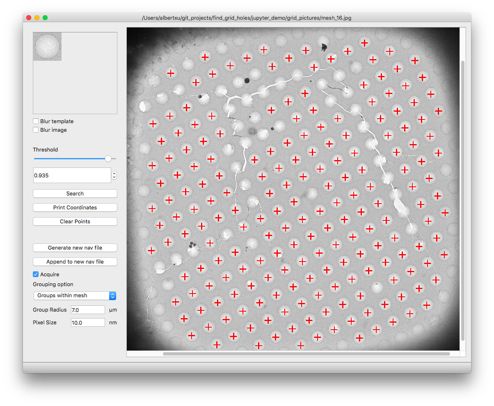
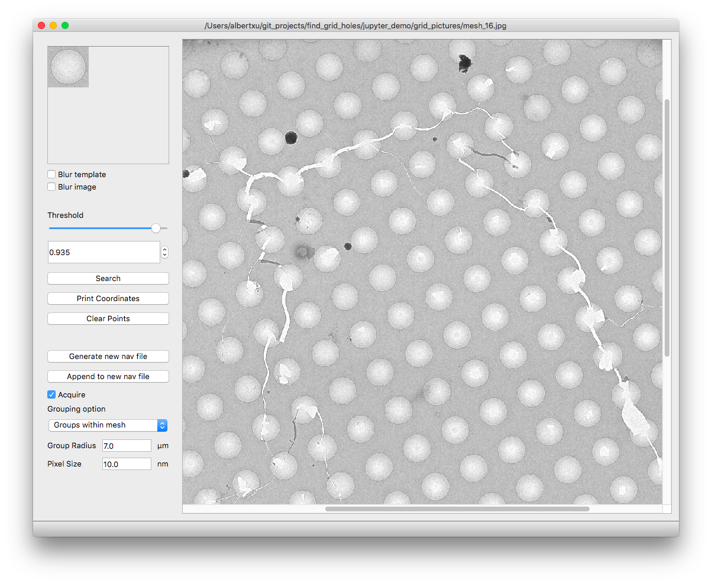
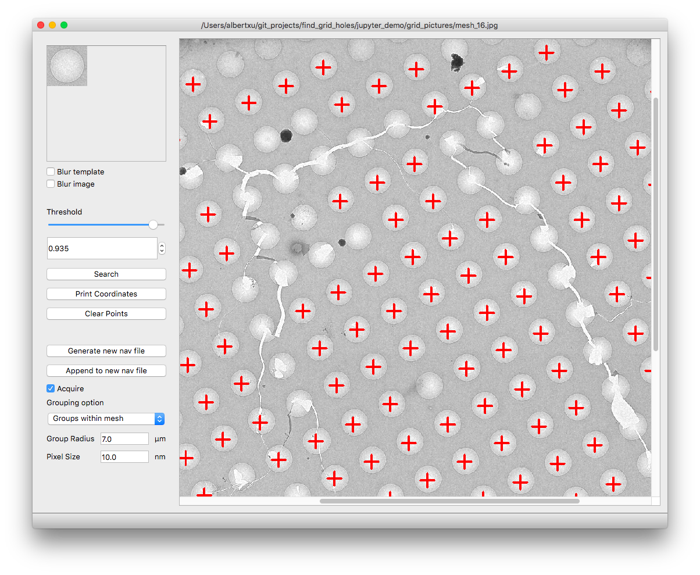
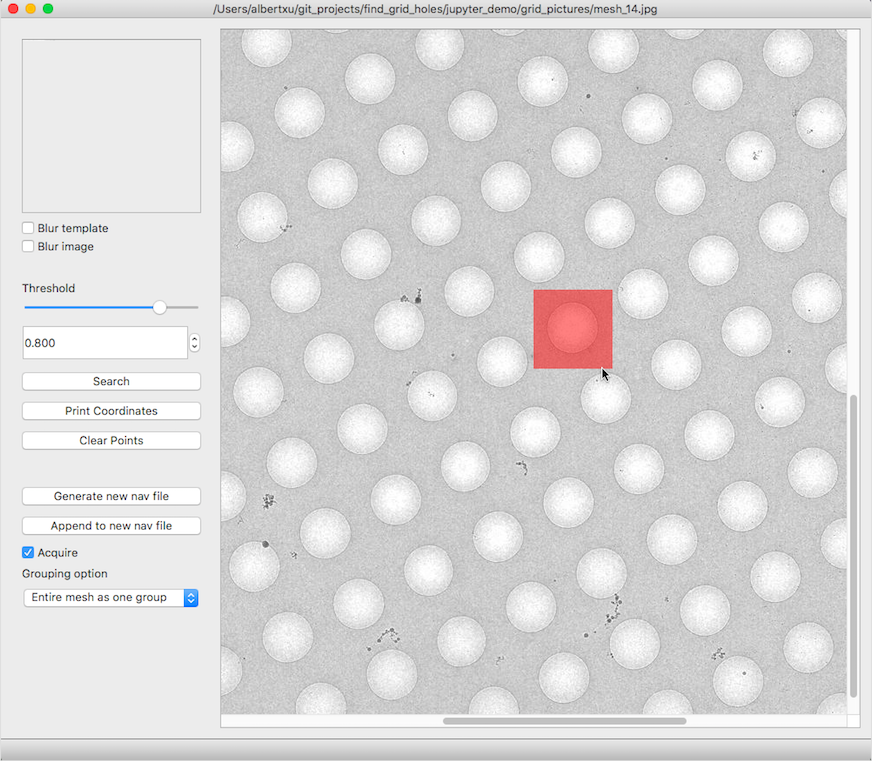
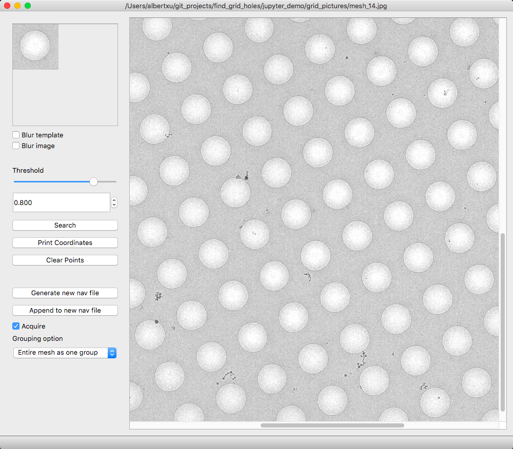

# Find Grid Holes

This program uses template matching to find the coordinates of mesh holes in SerialEM medium mag montages. These coordinates can be merged into the current session's navigator file as of SerialEM 3.7 beta.

[Download here](https://drive.google.com/drive/folders/194Ik9zU9WbOwGO2EH9s_f9Nd9qEh7OjJ?usp=sharing). Currently supports Windows Server 2008 R2, Windows 10, and Mac OS.

## Usage
  > This program will ask for a new starting label number of picked points. Having SerialEM open while using this program is convenient to avoid conflicting with existing points. Otherwise, choosing label numbers >5000 will probably suffice.

After opening Find Grid Holes, go to 'File'->'Load Nav File' and choose the navigator file you would like to merge points into.

To load an image, first use SerialEM to save an MMM map as a jpg file with binning 1. Then in Find Grid Holes, go to 'File'->'Open Image' and choose the jpg file.

To zoom in/out, use the minus and equal keys.

To crop a template image, just click and drag. Holding shift makes a square crop.

Play around with different templates and threshold values until you are satisfied.

Click 'Generate new nav file' to save the picked coordinates. You can continue to open new images and search for holes, and save those coordinates by clicking 'Append to new nav file' which will add them to the most recently generated new nav file.

The Acquire checkbox will mark the coordinates to be acquired when later merged into SerialEM.

The grouping options save the coordinates in groups. 'Groups within mesh' resembles SerialEM grouping, but is not the same algorithm.

In SerialEM merge the points by going to 'Navigator'->'Merge File' and choose the nav file generated by Find Grid Holes. You should see the new points in the MMM maps.

### Issues
MMM maps using binning 1 produces very large jpg files (>50 MB) that take too long to run in Find Grid Holes. Use binning 4.

SerialEM pixel to stage conversion is less accurate around the edges of maps. I don't know why.
